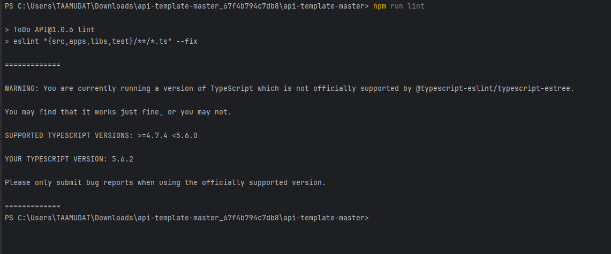
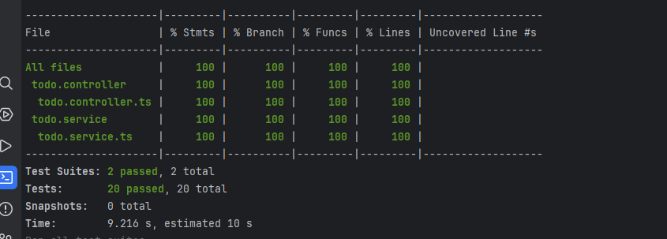
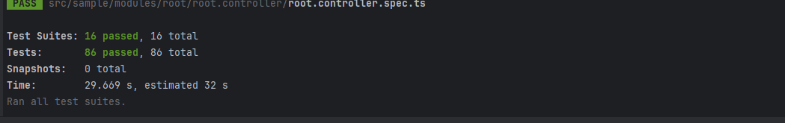
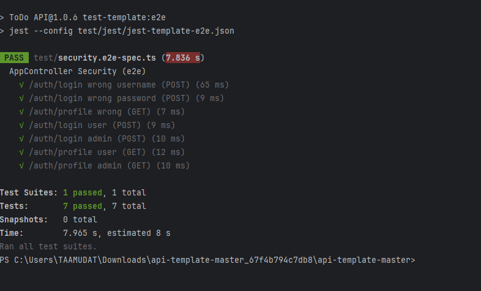

# Description

ICT-UEK 295 Prüfungsvorlage.

## Test

Es gibt mehrere Tests

für dich Massgebend sind die Tests, welche mit test-todo.... beginnen. Nur diese Tests werden in der Pipeline laufen gelassen.

```bash
# unit tests
$ npm run test-todo

# e2e tests
$ npm run test-todo:e2e

# test coverage
$ npm run test-todo:cov
```

### Projektinformationen
Projektname: Abschlussarbeit ük 295 Daniel Mürner
Projektdauer: 2d
Ersteller: Daniel Mürner

### Vorgehen / Aufgaben-tabelle

| Aufgabe                                            | soll Zeit | ist aufwand /h |
|----------------------------------------------------|-----------|----------------|
| Projekt beschreibung etc durchlesen                | 1h        | 30min          |
| Zeitplan erstellen                                 | 1h        | 30min          |
| package.json abändern                              | 30min     | 40min          |
| Teilaufgabe openapi                                | 1h        | 20min          |
| jwt security und .env datei einrichten             | 30min     | 2h 45min       |
| Crud controller und service Methoden für Todos     | 30min     | 15min          |
| CRUD-Routen implementieren und Testen              | 1h        | 30min          |
| Swagger-Authentifizierung & Api-Gruppierung prüfen | 30min     | 30min          |
| Unit tests                                         | 2h        | 1h             |
| e2e Test ausführen und Debugging                   | 1h        | 3h             |
| Linting & Code Stil Prüfung                        | 30min     | 20min          |
| Test Covarage                                      | 1.5h      | 2h             |
| Fazit und Pufferzeit                               | 2h        | 2h             |

## Fazit
Die aufgabe war recht schwierig, es gab viele Probleme, welche aber gelöst werden konnten, für mich ging es sehr gut auf, mit der Zeitplanung, zumindest bis am schluss, nicht mit den einzelnen teilen.
Aber jetzt funktioniert alles:




